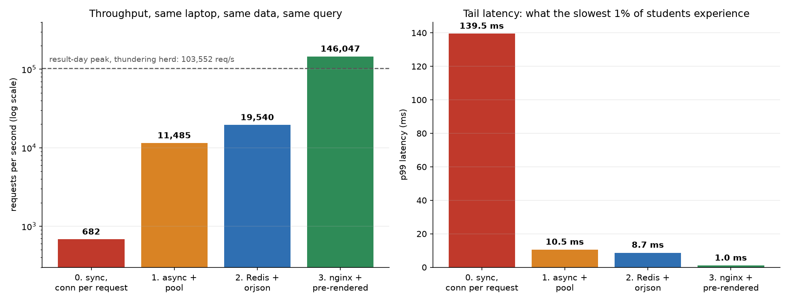

# fastapi-100k-rps

**682 to 146,047 requests per second on one laptop, same data, same query, same endpoint.**

Four stages. Each one changes a single architectural idea and the change is measured before the
next one starts. The point is not that FastAPI is fast or slow. The point is that the gap between
a service that falls over on its busiest day and one that does not is usually four decisions, and
you can put a number on each of them before you write the cheque.



## Results

Measured on a 13th Gen Intel i5-13420H, 12 cores, 30 GB RAM, Ubuntu 24.04, Python 3.13.5.
The load generator runs on the same machine as the server, so it competes for the same cores.

| Stage | What changed | req/s | p99 | Nodes for peak | Est. cost/month |
|---|---|---:|---:|---:|---:|
| **0** | Naive: `def` handler, new DB connection per request | 682 | 139.5 ms | 18 | $810 to $3,420 |
| **1** | `async def` + asyncpg connection pool, 12 workers | 11,485 | 10.5 ms | 2 | $90 to $380 |
| **2** | Redis read-through cache + orjson + single-flight | 19,540 | 8.7 ms | 1 | $45 to $190 |
| **3** | nginx serving pre-rendered JSON from RAM | 146,047 | 1.0 ms | 1 | $45 to $190 |

Stage 0 to stage 1 is a **16.8x** gain from two lines of code. Stage 0 to stage 3 is **214x**.

Tail latency matters more than the average here. At stage 0 the slowest 1% of students wait
139 ms before any network hop; at stage 3 they wait 1 ms. The mean would have hidden that.

## The scenario

Pakistani secondary school boards publish matriculation results on a fixed date at a fixed hour.
Five Punjab boards published together in 2025 for **767,054 candidates**. Every one of them, plus
parents and relatives, loads the same kind of page within the same few minutes. Portals routinely
buckle, which is the normal, boring, extremely common shape of this problem: a read-only workload,
an immutable dataset, and all of the traffic in a ten minute window.

The traffic model in `stage4_model.py` makes every assumption explicit and adjustable:

```
767,054 candidates x 3.0 lookups each x 1.8 retry factor = 4,142,092 lookups
70% of them inside the first 15 minutes, 25% of that in the heaviest minute
```

| Burst shape | Peak req/s | Nodes, naive stack | Nodes, stage 3 |
|---|---:|---:|---:|
| Moderate, spread over 15 minutes | 3,222 | 5 | 1 |
| Severe, half the burst in minute one | 24,162 | 36 | 1 |
| Thundering herd, a quarter of all lookups in 10 seconds | 103,552 | **152** | **1** |

The retry factor is the part people leave out. When a page stalls, users refresh, and the refresh
is what converts a slow server into a dead one. 1.8 is conservative.

## The four stages

### Stage 0: how these services usually get written

`app_stage0.py`. Three mistakes, all of them common in production:

1. a blocking `def` handler, so every request occupies a thread-pool worker
2. `psycopg2.connect()` inside the handler, a fresh TCP connection and auth handshake per request
3. no caching, so an immutable row is read from Postgres on every single request

**682 req/s, p99 139 ms.** Almost all of that time is connection setup, not the query.

### Stage 1: async and a connection pool

`app_stage1.py`. Two changes and nothing else, so the measurement attributes the difference to
those two things only: `async def` instead of `def`, and one asyncpg pool created at startup.

**11,485 req/s, p99 10.5 ms.**

`sweep.sh` isolates the two variables. Pool size barely moves the number past 32; worker count is
what matters, and it stops improving at 12 on a 12-core box. `multibench.sh` exists to answer the
obvious objection: is 11.5k the server's ceiling or the load generator's? Running three independent
generators and summing them gives 8,001 req/s, lower than one generator managed, which says the
single generator was not the bottleneck and the server was.

### Stage 2: cache the thing that never changes

`app_stage2.py`. A published result is immutable, so Postgres should be read **once per roll
number, ever**. Three changes: a Redis read-through cache with no TTL, orjson with a `Response`
returned directly so FastAPI does not re-serialise or validate, and single-flight on cache miss.

Single-flight is the interesting one. When a thousand requests want the same uncached key at the
same instant, one goes to the database and the rest await its future. Set `SINGLE_FLIGHT=0` to
watch the thundering herd arrive at Postgres instead.

**19,540 req/s, p99 8.7 ms.**

### Stage 3: stop computing at request time

`prerender.py` and `nginx.conf`. If the data is immutable and known in advance, there is no reason
for any application code to run when a request arrives. Render every result to a JSON file at
publish time and serve bytes.

200,000 blobs written to `/dev/shm` in 3 seconds, 782 MB. Sharded 1000 files per directory,
because a single directory with hundreds of thousands of entries is slow to traverse. nginx serves
them with `sendfile`, `access_log off`, and `open_file_cache` sized to the whole set, because at
this rate `open()` and `stat()` cost real time.

**146,047 req/s, p99 1.0 ms**, with no Python in the request path at all.

### Stage 4: what it costs

`stage4_model.py` turns the measured throughput into nodes and dollars. The headline: in the
thundering herd scenario the naive stack needs **152 nodes** and the pre-rendered one needs **1**.
That is not a tuning difference, it is an architectural one, and it was knowable before a single
server was provisioned.

## Reproducing it

```bash
git clone https://github.com/IsrarAhmed919/fastapi-100k-rps.git && cd fastapi-100k-rps
python3 -m venv .venv && .venv/bin/pip install -r requirements.txt

docker compose up -d                                  # Postgres on 5434, Redis on 6380
python3 generate_dataset.py --count 400000            # 800k synthetic rows, ~94 MB
.venv/bin/python load_db.py                           # COPY load, about 1.7s

# Stage 0
.venv/bin/uvicorn app_stage0:app --port 8000 &
.venv/bin/python bench.py --url "http://127.0.0.1:8000/result/{}" --conns 64 --seconds 15

# Stage 1  (./sweep.sh and ./multibench.sh for the pool and worker analysis)
./start_stage1.sh
.venv/bin/python bench.py --url "http://127.0.0.1:8001/result/{}" --conns 64 --seconds 15

# Stage 2
.venv/bin/uvicorn app_stage2:app --port 8002 --workers 12 &
.venv/bin/python bench.py --url "http://127.0.0.1:8002/result/{}" --conns 64 --seconds 15

# Stage 3
.venv/bin/python prerender.py --count 200000 --out /dev/shm/results
docker run -d --name nginx_stage3 --network host \
  -v "$PWD/nginx.conf:/etc/nginx/nginx.conf:ro" \
  -v /dev/shm/results:/srv/results:ro nginx:alpine
ab -k -c 100 -n 150000 "http://127.0.0.1:8003/result/123456"

# Capacity model and charts
python3 stage4_model.py && python3 chart.py
```

`bench.py` has no dependencies beyond the standard library. It uses persistent keep-alive
connections, which is what a real client does, and reports p50, p95 and p99 rather than a mean.

## Honest limits

These numbers are real and reproducible, and they are also measured in a way that flatters some
stages and penalises others. Both directions are listed.

- **Stage 3 was measured with `ab`, stages 0 to 2 with `bench.py`.** Different tools, so the
  146,047 is not strictly comparable to the other three. It is the right order of magnitude and
  the direction is not in doubt, but treat the exact ratio with care.
- **Load generator and server share 12 cores.** Every number is lower than the same code would
  reach with the generator on a separate machine. Conservative.
- **No network.** Everything is over loopback. A real deployment adds a hop that the p99 here
  does not include.
- **Postgres runs on tmpfs.** Disk IO is deliberately removed, because disk speed is not what is
  being measured. Stage 0 and 1 would be worse on a real disk.
- **Stage 3 pre-rendered 200,000 of the 800,000 rows**, not all of them. Rendering is linear and
  took 3 seconds for 200k, so the full set is roughly 12 seconds, but it was not measured.
- **The cost figures are list-price approximations** for a 12-core class VM as of September 2026,
  given as a range across budget and major providers rather than a single vendor quote.

## A note on the data

The dataset is **entirely synthetic**, generated by `generate_dataset.py` from a fixed seed.

Real board results were not collected, and that was a deliberate choice rather than a convenience.
Bulk-collecting them would mean holding personal records of hundreds of thousands of minors, and
it would mean hammering the very servers this project is about. The generator mirrors the real
schema instead: roll number ranges, the nine subject list, per-subject marks on a realistic
ability curve, totals, percentages, grade bands and pass or fail. Every performance number
measured against it transfers directly, and anyone can regenerate the identical 800,000 rows with
one command.

## Licence

MIT. See [LICENSE](LICENSE).
